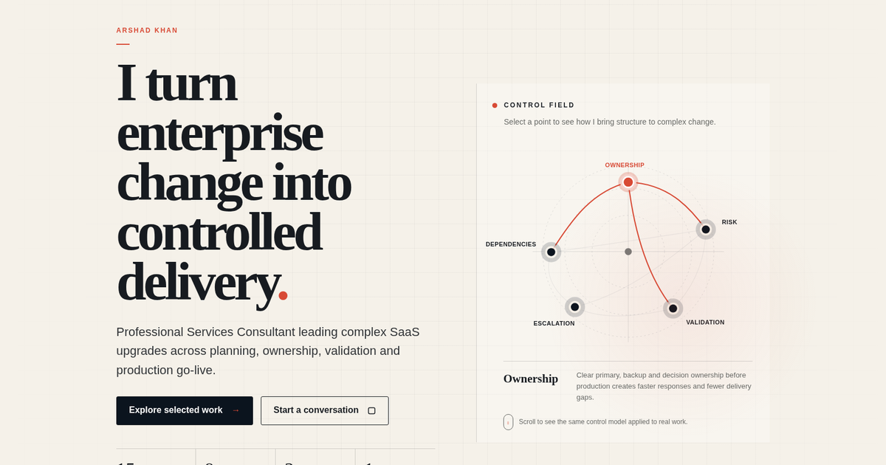

<div align="center">



# Arshad Khan — Enterprise SaaS Delivery Portfolio

### Turning complex enterprise change into controlled delivery.

A personal portfolio showcasing my experience in enterprise SaaS delivery, upgrade leadership, client advisory, validation, cross-functional coordination and practical AI-driven innovation.

[**View Live Portfolio →**](https://arshhhad.github.io/Goat/)

</div>

---

## About the Portfolio

This portfolio is designed to go beyond a traditional online résumé.

It presents how I approach complex enterprise work—creating clarity around ownership, dependencies, risks, validation and escalation while keeping delivery moving toward a successful outcome.

The website brings together my:

* Professional experience and career progression
* Enterprise SaaS upgrade delivery work
* Selected case studies and delivery outcomes
* Core capabilities and areas of ownership
* AI-assisted workflow and product-thinking initiatives
* Direction toward solutions architecture

---

## What I Do

I currently work as a **Professional Services Consultant**, leading and coordinating enterprise SaaS upgrade engagements across planning, client communication, environment readiness, validation, UAT and production go-live.

My work frequently involves:

* End-to-end upgrade coordination
* Client and stakeholder communication
* Readiness and dependency management
* Risk identification and escalation
* UAT planning and validation
* SSO, SAML and integration-impact coordination
* Cross-functional collaboration with technical teams
* Production deployment and post-go-live handover

---

## Portfolio Highlights

### Selected Work

The portfolio includes concise case studies focused on judgment, delivery ownership and practical problem-solving rather than simply listing responsibilities.

### Capabilities

A transparent breakdown of:

* What I independently own
* What I coordinate and validate
* What I am deliberately building toward

### Innovation at Work

The portfolio also presents practical innovation concepts connected to real delivery challenges, including:

* **AI Upgrade Daily Brief** — an AI-assisted workflow for converting Outlook, Teams and Calendar activity into a structured operational summary
* **Upgrade Impact Radar** — a prototype concept for identifying upgrade-risk areas and suggesting focused validation scenarios

### Career Direction

My long-term direction is toward broader **solutions architecture and solution ownership**, including architecture communication, solution scoping, estimation and technical trade-off decisions.

---

## Built With

* Semantic HTML5
* Modern CSS
* Vanilla JavaScript
* Responsive web design
* Accessible navigation and interactions
* GitHub Pages

No frontend framework or build process is required.

---

## Run Locally

Clone the repository:

```bash
git clone https://github.com/Arshhhad/Goat.git
```

Enter the project directory:

```bash
cd Goat
```

Open `index.html` directly in your browser, or run it using a local development server such as the VS Code Live Server extension.

---

## Project Structure

```text
Goat/
├── index.html
├── favicon.svg
├── og-image.png
├── robots.txt
├── sitemap.xml
├── .nojekyll
└── README.md
```

---

## Design Direction

The visual system combines:

* Strong editorial typography
* Structured enterprise storytelling
* Clear information hierarchy
* Responsive interactions
* Focused motion and visual depth
* A professional but human tone

The objective is to communicate one central impression:

> **He can handle serious responsibility—and people will enjoy working with him.**

---

## Confidentiality

This portfolio communicates professional experience, delivery approaches and outcomes at a high level.

Confidential client information, credentials, proprietary implementation details and restricted company material are intentionally excluded.

---

## Contact

For professional opportunities, collaborations or conversations:

* **Portfolio:** [arshhhad.github.io/Goat](https://arshhhad.github.io/Goat/)
* **LinkedIn:** [Connect with me](https://www.linkedin.com/)
* **Email:** [arshad.job255@gmail.com](mailto:arshad.job255@gmail.com)

---

<div align="center">

Designed and built by **Arshad Khan**

© 2026 Arshad Khan

</div>
